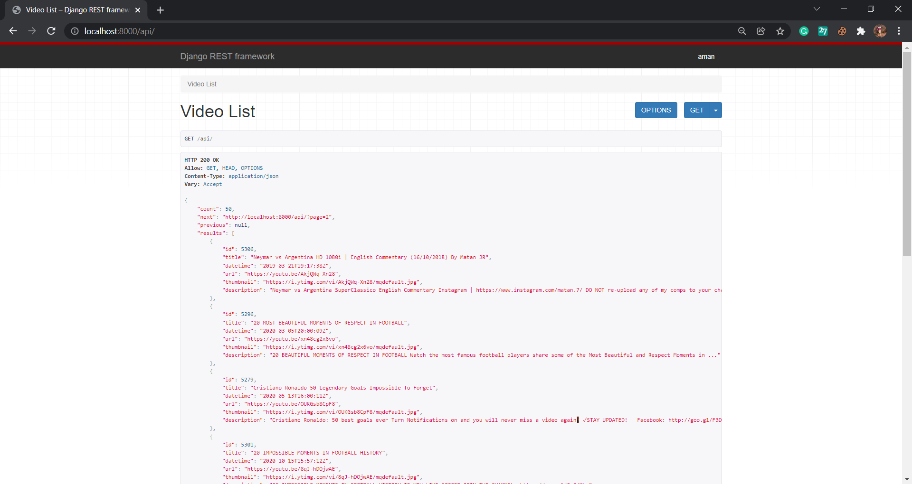
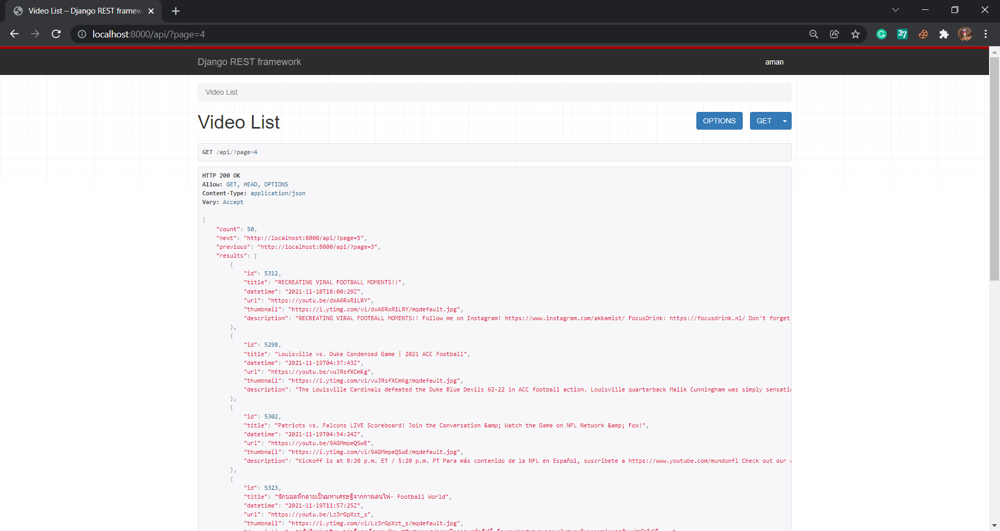
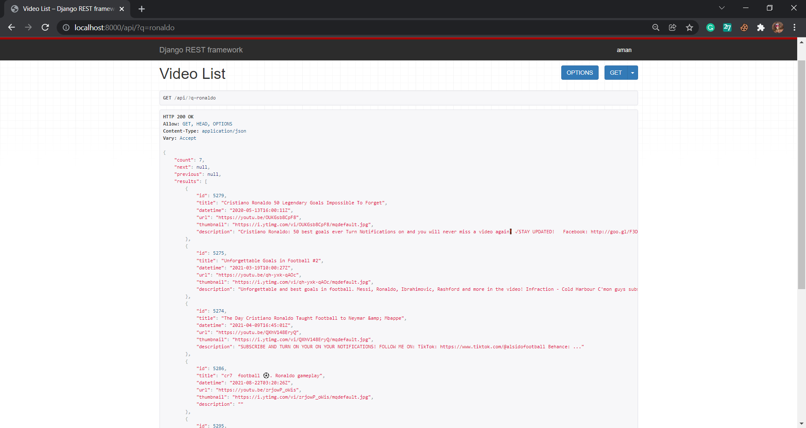

# Joshtalks-assignment

Custom Youtube listing and search API for query "football" using Youtube Data API v3. Made Entirely on Python, Django, and Django Rest Framework.

## How it works

1. It shows the top 100 Youtube searches ordered by Date and Time for the query "football."

2. It continuously updates the 100 searches by running asynchronously in the background using the django-background-task.

### Features:

Shows title, Description, thumbnail URL, Published date and time, and Video URL.

## How to Use

1. It shows 10 results per page for the query "football" by default.

2. To get the results of the first page in JSON format, send a GET request at [localhost:8000/api/](localhost:8000/api/)
   

3. To get the results of any page number, provide a parameter for the same in URL itself [localhost:8000/api/?page=4](localhost:8000/api/?page=4)
   

4. To get the results of your desired query in the "football" category, provide a parameter for the same in URL itself [localhost:8000/api/?q=ronaldo](localhost:8000/api/?q=ronaldo)
   

## Initialize the project

### Create and activate a virtualenv:

1. `virtualenv venv`
   This will create a virtual environment called "venv" that helps with controlling dependencies.(For windows run `mkvirtualenv venv`)
2. `source venv/bin/activate` ( For windows run `workon venv` )

### Install dependencies:

(while in the activated virtual environment)

```bash
pip install -r requirements.txt
```

**Note:** After installing dependencies, pip-tools are also installed. You can now use it to manage the package dependencies of your project.

Add a new package to requirements.txt and run the following command to auto-update requirements.txt file

```bash
pip freeze > requirements.txt
```

Run the following command to sync your virtualenv

```bash
pip-sync
```

This will install/upgrade/uninstall everything necessary to match the requirements.txt contents.

## Set Your API key

Open the Youtube_Search/settings.py file and change YourAPIKey with 'Google developer generated API of Youtube Data API v3' here:

```python
YOUTUBE_API_KEY = 'YourAPIKey'
```

(For the sake of simplicity, I have not hidden my API key in the project)

## Migrate, create a superuser, and run the server:

```bash
python manage.py makemigrations
python manage.py migrate
python manage.py createsuperuser
python manage.py runserver
```

## Security settings for Postgresql

There are a couple of security settings to setup manually. Open the core/settings.py file and change USER and PASSWORD here:

```python
DATABASES = {
    'default': {
        'ENGINE': 'django.db.backends.postgresql',
        'NAME': 'database name',              #change this with your database name
        'USER': 'postgres',                   #change this with your postgresql username. default is 'postgres'
        'PASSWORD': 'postgresql password',    #change this with your postgresql password
        'HOST': 'localhost',
    }
}
```

(For the sake of simplicity, I have not hidden my Postgresql settings in the project)
